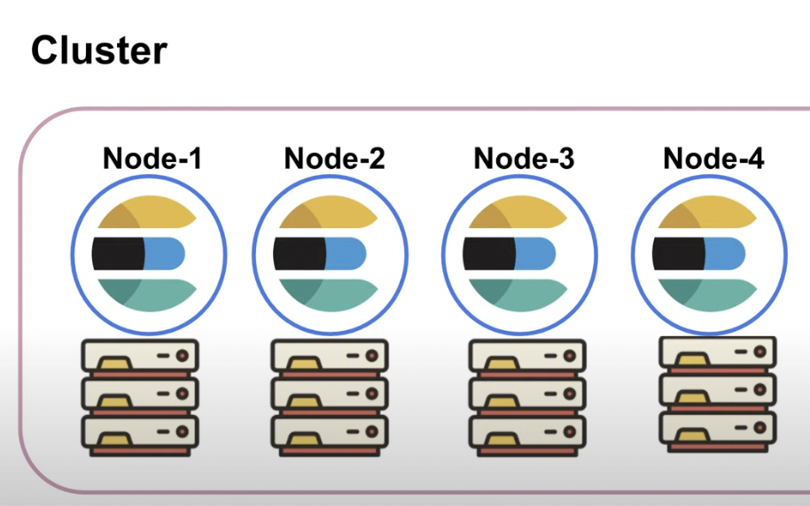
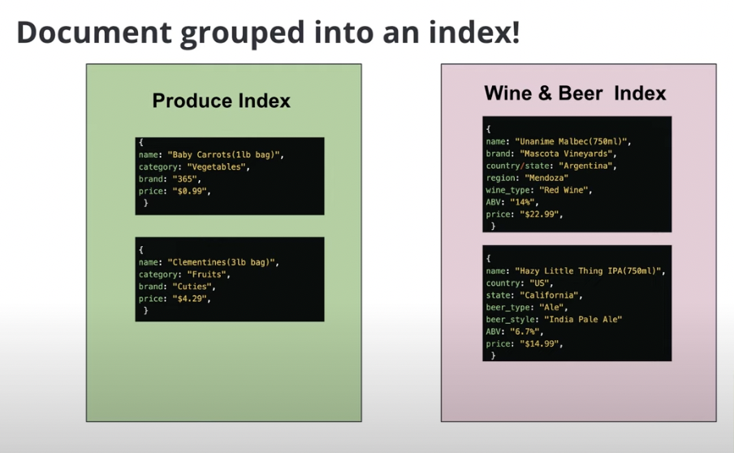
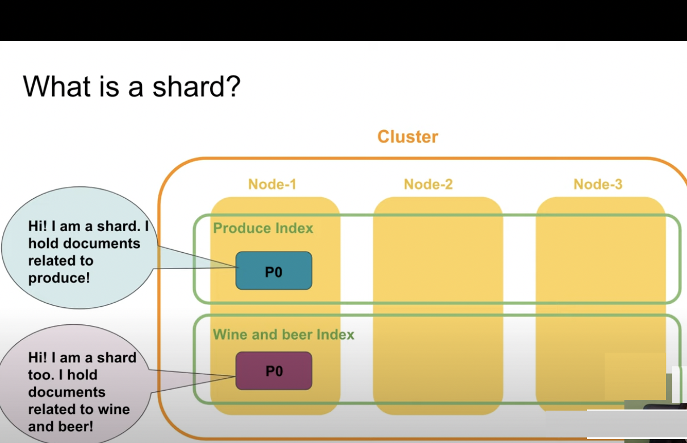
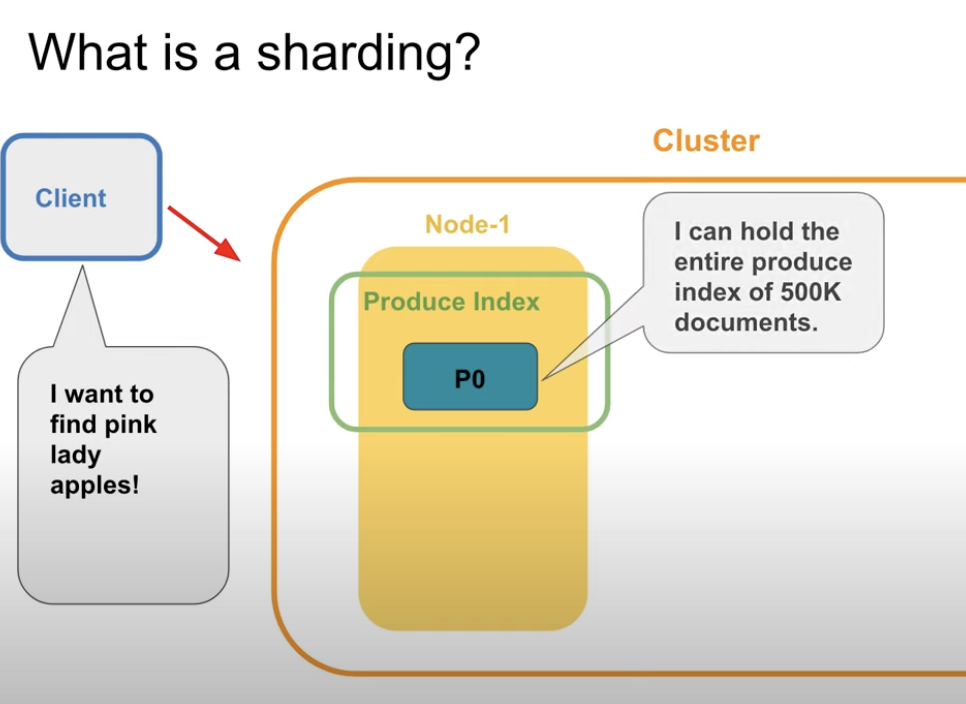
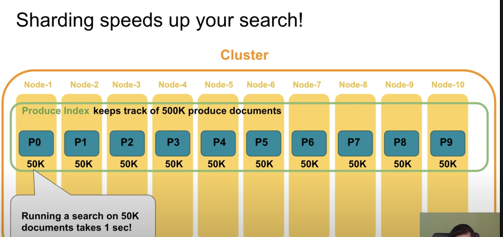

# Elastic Search ve Kibana
## _Kibana Notları_
Veri analiz ve görselleştirmede kullanılan bir araçtır Elasticsearch ile birlikte kullanılır.Elasticsearch clusterlarının izlenmesi,yönetilmesi gibi işlemlerin merkezleştirildiği yapılar sağlar.
- log ve log analizi 
- altyapı metrikleri ve container yönetimi
- geospatial veri analizi ve görselleştirme
- güvenlik analizleri 

ElasticSearch üzerinde index ler üzerinde veri sorgulama ve Lens,Canvas ve Map ile görselleştirme sağlayabilmekte. 

Kibana da dashboard olusturabilmek icin Elasticsearch icinde index bulunmalidir. 
## ElasticSearch 

ElasticSearch REST API uzerinden clusterlara erismemizi ve iletisim saglayabilmemize olanak saglar. Search request gonderdigimizde HTTP request port 9200 a gider. Ilgili portta calisan elasticsearch e request yolladigimizda bize cluster ve elasticSearch versiyon bilgisi geri gonderir. 

```
curl localhost:9200
```

```
{
  "name" : "4d899444b95a",
  "cluster_name" : "docker-cluster",
  "cluster_uuid" : "sGgxn3BVTp-Ji546RVG7Yw",
  "version" : {
    "number" : "8.2.0",
    "build_flavor" : "default",
    "build_type" : "docker",
    "build_hash" : "b174af62e8dd9f4ac4d25875e9381ffe2b9282c5",
    "build_date" : "2022-04-20T10:35:10.180408517Z",
    "build_snapshot" : false,
    "lucene_version" : "9.1.0",
    "minimum_wire_compatibility_version" : "7.17.0",
    "minimum_index_compatibility_version" : "7.0.0"
  },
  "tagline" : "You Know, for Search"
}
```

Elasticsearch bir node uzerinde calisir. Bu nodun Unique id si ve ait oldugu bir cluster vardir. Farkli makinalarda farkli nodelar uzerinde elasticsearch calisiyor olabilir. Bu nodlarin ait oldugu bir  cluster olabilir 




Veriler document olarak Json objesi formatinda tutulur. Her bir document bir unique id ye sahiptir.
```
{ name :"Clementines",
  category:"Fruits",
  brand:"Cuties",
  price:"$4.29"
```  

Benzer Dokumanlar Indexler halinde grouplanir. 



Bir index birden fazla node a bagli olabilir. Ve ilgili index in bir node icindeki parcasina shard diyoruz.


Ornegin bir makinadaki shard 200bin veri tutabiliyor. 600 bin veri tutabilmek icin farkli nodelarda ek shardlar olusturulabilir. Veriler attikca yatay olarak shardlari tutacagimiz nodelari arttirabiliriz. 


Bir index olustugunda bir shard otomatik olarak olusur. Fakat ilgili configuration yapilarak birden fazla shard olusturulabilir. 

Ornegin bir makinadaki shard 200bin veri tutabiliyor. 600 bin veri tutabilmek icin farkli nodelarda ek shardlar olusturulabilir. Veriler attikca horizontally olarak shardlari tutacagimiz nodelari arttirabiliriz. 



Diyelim ki tum verilerimizi tek bir shard icinde 500k olarak tutuyoruz. Sequential Search 10 sn suruyor. Bu verileri farkli nodelarda dagitirsak ornegin 10 node ve her shard 50k veri tutuyorsa bu durumda 1sn surede paralel olarak 1sn surecektir. 



Fakat birden fazla node uzerinde tututulan durumda nodlardan biri giderse, verileri kaybetmis oluruz. Bu yuzden nodelarda tutulan shardlarin ikinci kopyalarini baska bir node uzerinde tutabiliriz. Bunlara primary shard ve replica shard deriz. Eger replica shard varsa bu search islemini de hizlandirir. Bir saniyede 8000 query geldigi bir durum dusunuldugunde eger replica shard varsa bazi destek saglayabilir. 


[CrashCourceGit](https://github.com/LisaHJung/Beginners-Crash-Course-to-Elastic-Stack-Series-Table-of-Contents)
[Beginner](https://github.com/LisaHJung/Part-1-Intro-to-Elasticsearch-and-Kibana)


Calisan clusterlarin saglik durumunu incelemek icin 

```
curl -u elastic:changeme http://localhost:9200/_cat/health 
```

ElasticSerch uzerinde olusturcagimiz cluster ve node lari daha anlamli isimler ile degistirmekte yarar var. Ozellikle clusterlar buyudukce bu gereklilik olusturuyor. (bu islemi yaml elasticsearch un kurulu oldugu folder altinda bulunan yaml dosyasi icindeki cluster.name ve node.name  parameteresini degistirerek yapabliriz. Bu islemler sonrasinda elasticsearch ve kabana yeniden baslatilmali)


## Request Gonderme

Kabana localhost:5601 uzerinde calisiyor. 

Management->DevTools menusunde Console bulunmakta. 

Bulunan cluster larimiz hakkindaki health bilgisini getirmek icin 

```
GET _cluster/health

{
  "cluster_name" : "docker-cluster",
  "status" : "green",
  "timed_out" : false,
  "number_of_nodes" : 1,
  "number_of_data_nodes" : 1,
  "active_primary_shards" : 8,
  "active_shards" : 8,
  "relocating_shards" : 0,
  "initializing_shards" : 0,
  "unassigned_shards" : 0,
  "delayed_unassigned_shards" : 0,
  "number_of_pending_tasks" : 0,
  "number_of_in_flight_fetch" : 0,
  "task_max_waiting_in_queue_millis" : 0,
  "active_shards_percent_as_number" : 100.0
}

```

Bulunan nodelar ve hakkindaki bilgilere erismek icin 

```
GET _nodes/stats


{
  "_nodes" : {
    "total" : 1,
    "successful" : 1,
    "failed" : 0
  },
  "cluster_name" : "docker-cluster",
  "nodes" : {
    "sTmt1bClSAeachl428phwA" : {
      "timestamp" : 1653169355697,
      "name" : "4d899444b95a",
      "transport_address" : "172.18.0.2:9300",
      "host" : "172.18.0.2",
      "ip" : "172.18.0.2:9300",
      "roles" : [
        "data",
        "data_cold",
        "data_content",
        "data_frozen",
        "data_hot",
        "data_warm",
        "ingest",
        "master",
        "ml",
        "remote_cluster_client",
        "transform"
      ],
      "attributes" : {
        "ml.max_jvm_size" : "5343543296",
        "xpack.installed" : "true",
        "ml.machine_memory" : "10685800448"
      },
      "indices" : {
        "docs" : {
          "count" : 271,
          "deleted" : 7566
        },
        "shard_stats" : {
          "total_count" : 8
        }
        ...
}

```

- Index olusturma (asagida favorite_candy adinda bir index olusturduk) `Syntax : PUT Name-of-the-Index`

```
PUT favorite_candy

{
  "acknowledged" : true,
  "shards_acknowledged" : true,
  "index" : "favorite_candy"
} 

```

- Olusturdugumuz index e bir dokuman ekleyelim. 

```
POST Name-of-the-Index/_doc
{
  "field": "value"
}
```

Hem post hem put kullanilabilir. Post kullanildiginda elasticsearch automatik olarak id olusturur dokuman icin. POST ardindan index adi ve `_doc` keyword ile birlikte json formatindaki dokumani gonderiyoruz. Bize auto generated id ile donus yapar. 

```
POST favorite_candy/_doc
{
  "first_name": "Lisa",
  "candy": "Sour Skittles"
}

{
  "_index" : "favorite_candy",
  "_id" : "ohei6IABIUJON3OvB1B7",
  "_version" : 1,
  "result" : "created",
  "_shards" : {
    "total" : 2,
    "successful" : 1,
    "failed" : 0
  },
  "_seq_no" : 0,
  "_primary_term" : 1
}
```

```
PUT Name-of-the-Index/_doc/id-you-want-to-assign-to-this-document
{
  "field": "value"
}
```

```
PUT favorite_candy/_doc/1
{
  "first_name": "John",
  "candy": "Starburst"
}

{
  "_index" : "favorite_candy",
  "_id" : "1",
  "_version" : 1,
  "result" : "created",
  "_shards" : {
    "total" : 2,
    "successful" : 1,
    "failed" : 0
  },
  "_seq_no" : 1,
  "_primary_term" : 1
}
```

Ozellikle hastalarin oldugu bir veride idlerin autogenerate olmamasi daha anlamli olabilir. 

- Kayitlari okuma `GET Name-of-the-Index/_doc/id-of-the-document-you-want-to-retrieve`

```
GET favorite_candy/_doc/1

{
  "_index" : "favorite_candy",
  "_id" : "1",
  "_version" : 1,
  "_seq_no" : 1,
  "_primary_term" : 1,
  "found" : true,
  "_source" : {
    "first_name" : "John",
    "candy" : "Starburst"
  }
}

```

Bir dokumani mevcut olan bir id ile ekledigimizde
versiyon 2 olarak geri donus olur ve veri update edilir. Versiyon bir verinin kac kez create,update yada delete oldugunu belirtir. 

```
PUT favorite_candy/_doc/1
{
  "first_name": "John2",
  "candy": "Starburst2"
}

{
  "_index" : "favorite_candy",
  "_id" : "1",
  "_version" : 2,
  "result" : "updated",
  "_shards" : {
    "total" : 2,
    "successful" : 1,
    "failed" : 0
  },
  "_seq_no" : 4,
  "_primary_term" : 1
}
```

Ayni id ye sahip dokumana tekrar get request yaparsak, source bilgisi overwrite yapilmis oldugunu goruruz. Fakat bu pek istenen bir durum degil.

```
GET favorite_candy/_doc/1
{
  "_index" : "favorite_candy",
  "_id" : "1",
  "_version" : 2,
  "_seq_no" : 4,
  "_primary_term" : 1,
  "found" : true,
  "_source" : {
    "first_name" : "John2",
    "candy" : "Starburst2"
  }
}
```

Bu yuzden `_create` keyword unu kullaniriz. 

- Create dokuman 

```
PUT Name-of-the-Index/_create/id-you-want-to-assign-to-this-document
{
  "field": "value"
}
```

Mevcut bir id ile dokuman create etmeye calisirsak bize hata mesaji ile donecektir. 


```
PUT favorite_candy/_create/1
{
  "first_name": "Finn",
  "candy": "Jolly Ranchers"
}

{
  "error" : {
    "root_cause" : [
      {
        "type" : "version_conflict_engine_exception",
        "reason" : "[1]: version conflict, document already exists (current version [2])",
        "index_uuid" : "CtC5ZKxdRt2nNwin9IxemA",
        "shard" : "0",
        "index" : "favorite_candy"
      }
    ],
    "type" : "version_conflict_engine_exception",
    "reason" : "[1]: version conflict, document already exists (current version [2])",
    "index_uuid" : "CtC5ZKxdRt2nNwin9IxemA",
    "shard" : "0",
    "index" : "favorite_candy"
  },
  "status" : 409
}
```

- Update islemi icin `_update` keyword unu kullaniyoruz.

Mevcut bir veriyi sadece bazi belirli field lari kullanarak guncellemek istiyorsak
```
POST Name-of-the-Index/_update/id-of-the-document-you-want-to-update
{
  "doc": {
    "field1": "value",
    "field2": "value",
  }
} 
```


```
POST favorite_candy/_update/1
{
  "doc": {
    "candy": "M&M's"
  }
}

{
  "_index" : "favorite_candy",
  "_id" : "1",
  "_version" : 3,
  "result" : "updated",
  "_shards" : {
    "total" : 2,
    "successful" : 1,
    "failed" : 0
  },
  "_seq_no" : 5,
  "_primary_term" : 1
}

POST favorite_candy/_update/1
{
  "doc": {
    "sonradaneklenenfield": "bisey"
  }
}

{
  "_index" : "favorite_candy",
  "_id" : "1",
  "_version" : 4,
  "result" : "updated",
  "_shards" : {
    "total" : 2,
    "successful" : 1,
    "failed" : 0
  },
  "_seq_no" : 6,
  "_primary_term" : 1
}


```
Son durumda hem update etmek istedigimiz fieldlari goruyoruz hem de update ile yeni ekledigimiz fieldlari

```
GET favorite_candy/_doc/1

{
  "_index" : "favorite_candy",
  "_id" : "1",
  "_version" : 4,
  "_seq_no" : 6,
  "_primary_term" : 1,
  "found" : true,
  "_source" : {
    "first_name" : "John2",
    "candy" : "M&M's",
    "sonradaneklenenfield" : "bisey"
  }
}
```

Eger bir veriyi silmek istiyorsak `_delete` keyword unu kullaniyoruz. `DELETE Name-of-the-Index/_doc/id-of-the-document-you-want-to-delete`

```
DELETE favorite_candy/_doc/1

{
  "_index" : "favorite_candy",
  "_id" : "1",
  "_version" : 5,
  "result" : "deleted",
  "_shards" : {
    "total" : 2,
    "successful" : 1,
    "failed" : 0
  },
  "_seq_no" : 7,
  "_primary_term" : 1
}

GET favorite_candy/_doc/1

{
  "_index" : "favorite_candy",
  "_id" : "1",
  "found" : false
}
```

